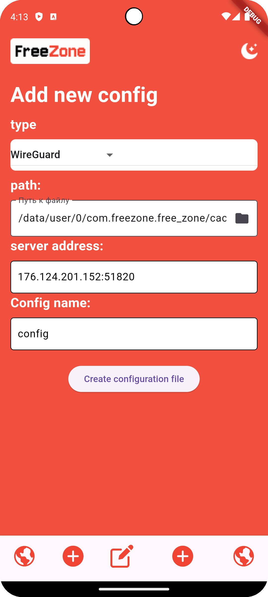
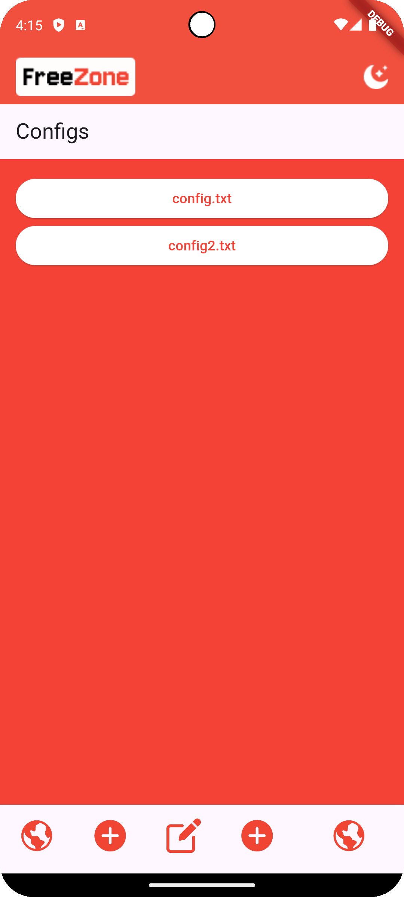
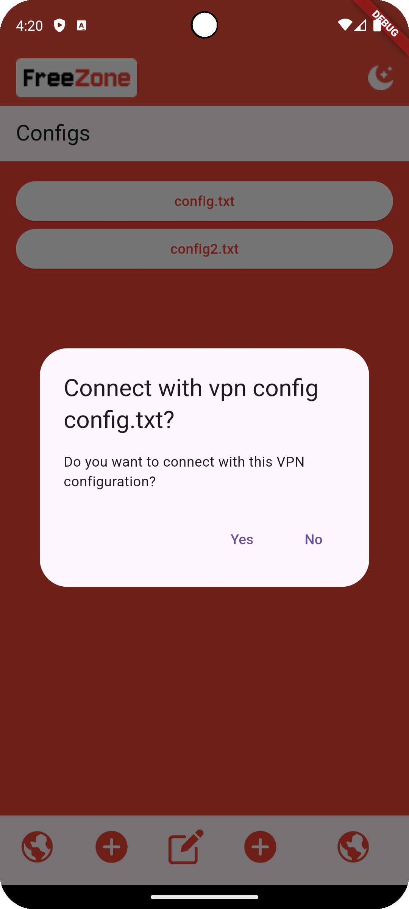

# FreeZone

VPN клиент для подключения с использованием различных протоколов VPN:
- WireGuard
- IKEv2

Основные возможности:

- Наличие редактора для клиентских конфигураций WireGuard/IKEv2
- Хранение созданных/загруженных конфигураций в памяти устройства
- Запуск сохраненных конфигураций VPN соединений

## Запуск проекта

1. Установите flutter 3.24+ / dart 3.5+ sdk
2. Установите android / ios sdk  
3. Выполните команду `flutter clean`
4. Выполните команду `flutter pub get`
5. Выполните команду `flutter run`
6. Откройте приложение в установленном эмуляторе или подключенном физическом устройстве

## Инструкции для пользователя

### Добавление новой конфигурации в клиенте

1. Нажать на кнопку с иконкой плюса
2. Выбрать типа протокола (Wireguard, IKEv2)
3. Задать путь к файлу с конфигурацией (в случае Wireguard)
4. Задать адрес удаленного VPN-сервера, к которому подключаемся
5. Задать название сохраняемого файла конфигурации
6. Нажать на кнопку `Create configuration file` - создастся файл с полной конфигурации под выбранный тип VPN протокола

### Просмотр сохраненных конфигов

1. Нажать на кнопку с иконкой планеты
2. Откроется список сохраненных конфигурационных файлов для различных протоколов 

### Запуск выбранного конфига

1. Нажать на конфигурацию из списка, представленного в предыдущем разделе
2. В появившемся окне нажать кнопку 'Yes' для создания VPN-соединения
3. В случае появления предложения о создании VPN-подключения приложением FreeZone согласиться с предложением

